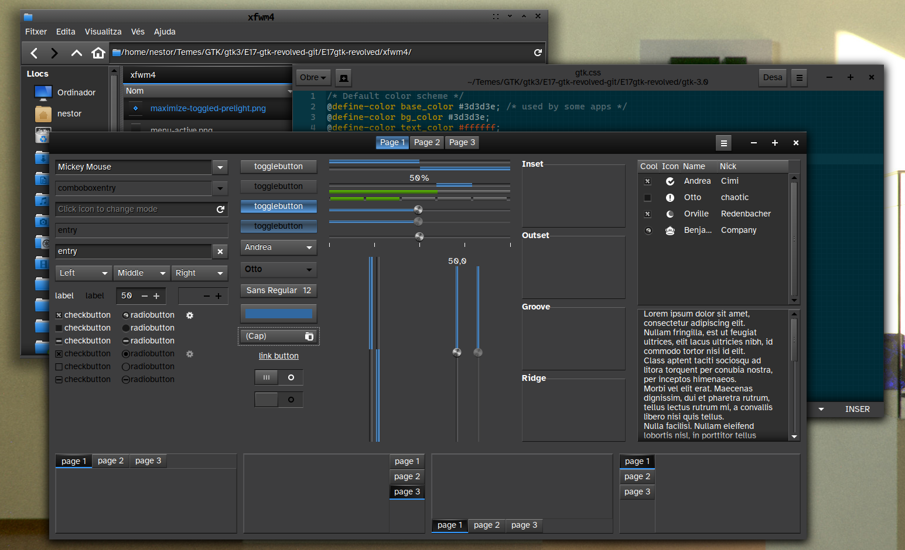
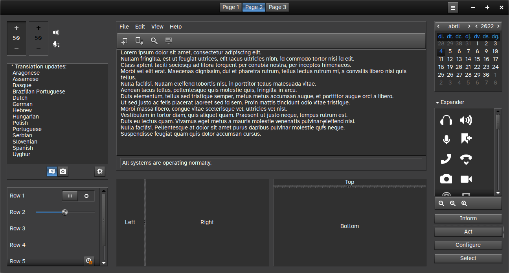
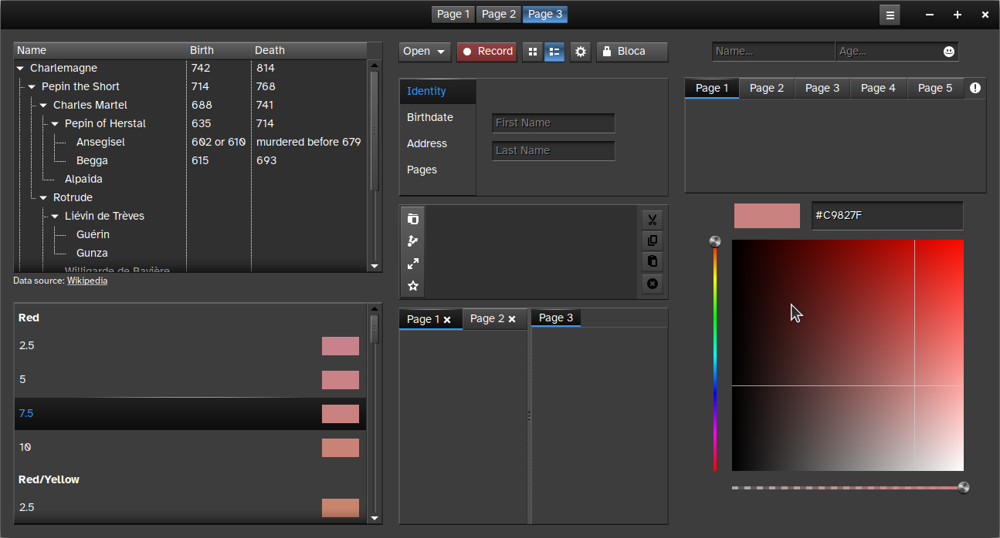
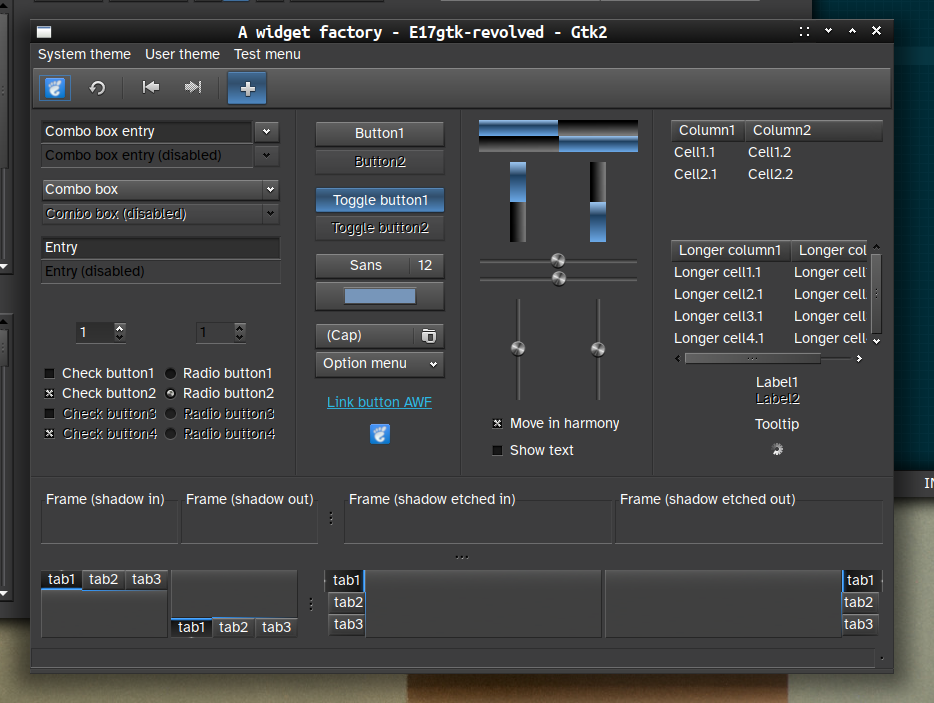

This is an evolution (fork) from the already wonderful E17GTK theme by TSUJAN (https://www.pling.com/p/1013662/ and https://github.com/tsujan/E17gtk).
This theme fits very well with the default theme for the Enlightenment desktop. It also matches Kvantum's default theme. It's dark gray with blue accents, and non-flat (quite skeuomorphic). It's very easy on the eyes and also very usable. It includes a GTK2 theme too.
It has some minor tweaks, here and there.

I have this theme as a git so if you clone it, you can always pull the latest updates without having to download it again. For example, you can go to your ~/.themes folder and execute there
git clone https://git.disroot.org/eudaimon/E17gtk-revolved.git
Then you just need to go to ~/.themes/E17gtk-revolved and execute "git pull" each time you'd like to check for updates (not very often, I should say).
You may also create a symbolic link in /usr/share/themes, so applications run as root (such as synaptic) can also appear correctly:
sudo ln -s ~/.themes/E17gtk-revolved /usr/share/themes/E17gtk-revolved

I've decided to add an option to donate money: If I had enough time and income, I'd definitely dedicate much more time to this activity, which I enjoy very much. Thank you! https://www.paypal.com/donate/?hosted_button_id=9LW4UGMXG6CQW

xfwm4 theme derived from one created by [pkfbcedkrz](https://www.pling.com/u/pkfbcedkrz). Many thanks!

Please also read the file WORKAROUNDS!

Screenshots:

